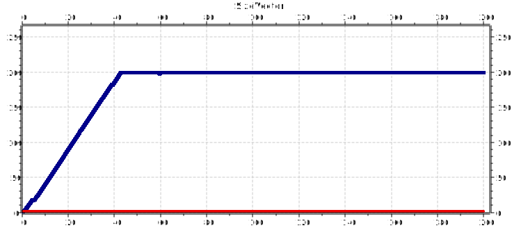

##LABORATORIO 2##
Redes y Sistemas Distribuidos

"Algoritmos de Congestion y Control de Flujo"

por Nahuel Borda y Paula Reyna

##Presentacion##
En este laboratorio se nos solicito realizar tres tareas:primeramente poder entender y generar
modelos con la herrramienta omnet++, analizar el trafico de una red a traves del uso de simulaciones de eventos discretos a partir del modelo de colas que nos fue entregado por la catedra
y el diseño e implementacion de algun algoritmo de control de congestion y flujo.
En esta introduccion, mencionaremos brevemente los componentes principales con los cuales trabajamos. En primer lugar, contabamos con un modelo de colas que constaba de un generador(gen),
una cola o buffer(queue)y un destino(sink), los cuales estan todos conectados a traves de una red llamada network, definida en network.ned.
Empezando por aqui abordamos la primera de las tareas: el analisis del trafico de red.

##Introduccion/Analisis##
Para poder realizar esta parte del laboratorio, tuvimos que implementar una serie de modificaciones
tanto en las conexiones del archivo network.ned, como en las clases de nuestros componentes iniciales en c++.
La idea aqui era basicamente, modificar la estructura del modelo de colas, donde nuestros
generator y sink pasarian a ser parte de modulos compuestos mas grandes, llamados nodeTx
(transmisor) y nodeRx (receptor). Estas modificaciones pueden verse en el archivo network.ned.
Luego, ya que se debia hacer un analisis extenso en cuanto a tamaño y cuanto se enviaba, los
objetos cMessage definidos anteriormente en los archivos ya nos nos eran de tanta utilidad ya que
no tienen parametros de tamaño en bytes. Fueron entonces reemplazados por objetos cPacket.
Esta modificacion inevitablemente conllevaba una modificacion en como queue manejaba los mensajes
(en el metodo handleMessage), debiendo ahora controlar si el packete nuevo no sobrepasaba el
limite configurado de tamaño maximo del buffer. Se agregaron vectores para el analisis de queue, 
y se modifico el archivo omnetpp.ini para darle a la simulacion los parametros necesarios para
ejecutarse.
Una vez realizados estos cambios fueron luego realizadas las simulaciones correspondientes.
De ellas generamos graficos, que muestran las problematicas de este modelo, y sobre las cuales
se posa nuestro. Presentaremos estas graficas a continuacion.

CASOS 1 y 2 - EX 1

Pudimos notar que ambos casos son analogos. En las graficas podemos ver claramente que no se
presento una perdida de paquetes, y de que los paquetes son receptados en sincronia a cuando
son enviados. Sin embargo , es facil ver que estamos desaprovechando recursos de red, ya que notamos que nuestros bufferes nunca se llenan, salvo en una ocasion particular(agregardonde),
nunca tienen mas de un elemento.

CASOS 1 y 2 - EX 0.1

En estos graficos podemos ver una perdida de paquetes, ya que los paquetes enviados son mayores
a los recibidos. Esto se da porque en un momento (40'') las colas se llenan, y con la poltiica de congestion que esta aplicada en este momento en el modelo, estos paquetes se eliminan. Esto
logicamente deriva en la perdida grande de paquetes que vemos representada en estas graficas.

CASOS 1 y 2 - EX 0.2

Los casos 1 y 2 son analogos, salvo por el hecho de que el caso 2 utiliza otra queue.
En este caso vemos que hay muy poca perdida de paquetes, ya que el numero de paquetes
enviados y recibidos no difieren en casi nada. Hay buen uso del espacio de bufferes.

CASOS 1 y 2 - EX 0.16

Podemos ver claramente que aqui hubo una perdida de paquetes (diferencia entre paquetes enviados y recibidos). Sin embargo, podemos ver que estos casos hacen un uso eficiente del espacio del buffer,
llenandose solo en un momento critico al final, lo cual tambien nos da como parametro que si
extendiesemos el tiempo en el cual debe correr la simulacion, esta situacion podria derivar
facilmente en perdida de paquetes y en colas que esten constantemente llenas.

CASOS 1 Y 2 - EX 0.17

Aqui podemos ver claramente que no hay perdida de paquetes, sin embargo , comparando con otros casos, podemos ver que su uso del espacio de la cola no es tan eficiente.

##Hipotesis - ¿Por que suceden estas cosas?##

Creemos que los problemas que se presentaron en los casos de analisis mencionados anteriormente
estan dados por una falla en el modelo de colas que poseemos actualmente, en especifico
en cuanto su manejo de las colas y su capacidad, lo cual en ambos casos fue lo que termino
derivando en congestion y perdida de paquetes.
Creemos entonces que la solucion es implementar otra politica de control de congestion, lo cual
pasaremos a hacer en la tercera y ultima tarea que nos fue asignada en este laboratorio

##Solucionando...##
Decidimos implementar un algoritmo basado en uno de los algoritmos de congestion utilizado por tcp, llamado de arranque lento.
¿ Como funciona el algoritmo de arranque lento ?
Primeramente, el emisor asigna a la ventana de congestion(VC) el segmento de tamaño máximo (STM) usado por la conexión; entonces envía 1 segmento.
Si se recibe el ack de este segmento antes que expire el temporizador, el emisor agrega el equivalente en bytes de un segmento a la VC para
hacerla de 2 STM y envía dos segmentos. Cuando la VC es de n segmentos, si de todos los n se reciben acks a tiempo, se aumenta la VC en la cuenta de bytes correspondiente a n segmentos. La VC sigue creciendo exponencialmente hasta expiración del temporizador (timeout) o alcanzar el tamaño de la ventana receptora. Si ocurre timeout se recorta la VC a tamaño VC/2, o sea no se enviarán ráfagas de segmentos mayores a VC/2.
#Nuestra implementacion de arranque lento#
Tenemos una ventana que arranca en uno, por lo tanto envia un paquete. Luego llega un ack, y la ventana se duplica. Cuando llega este numero
correspondiente de acks, se duplica de nuevo, y asi sucesivamente.Cuando llega un mensaje de lost, esto señaliza que el buffer esta congestionado
Si esto sucede, se limpia el buffer, y se divide la ventana a la mitad.

#ANALISIS FINAL Y CONCLUSIONES 

CASOS 1 y 2 

Sin necesidad de hacer mas analisis, podemos ver que nuestro intento de implementar el algoritmo de arranque lento no fue exitoso
Podemos ver perdidas de paquetes, y hasta cierta constancia en los graficos, que nos dan para pensar tanto en la eficacia de la implementacion como de los resultados obtenidos.
El algoritmo de arranque lento es conocido por no ser la solucion mas optima a la congestion, y nuestra implementacion en particular
no ataca al problema de la congestion en la cola intermedia, lo cual podria estar entorpeciendo los datos obtenidos. Los graficos varian desde metricas respecto a el tamaño de buffers, paquetes perdidos vs paquetes enviados, etc. 
Podemos entonces concluir que nuestro algoritmo de control de congestion y flujo no funciona como deberia, es decir, no previene la perdida de paquetes y tampoco beneficia a un buen uso de la red subyacente planteada en network.ned

Finalmente, nos hubiera gustado haber tenido mas tiempo a la hora de implementar el algoritmo de congestion, para poder investigar mejores ideas y mucho mas optimas. Sin embargo, conocer como se trasladan paquetes, y como funciona la red interna de las capas de transporte resulta muy interesante, ya que el trafico de red y sus algoritmos es una cosa fundamental para entender la eficiencia de las networks modernas.
Creemos tambien que si bien omnet++ es una herramienta muy util, la informacion que existe sobre este software, y como solucionar problemas con este (desde su instalacion hasta como definir una clase para que la reconozca), no es la suficiente como para no tener que estar "luchando" constantemente contra el.

